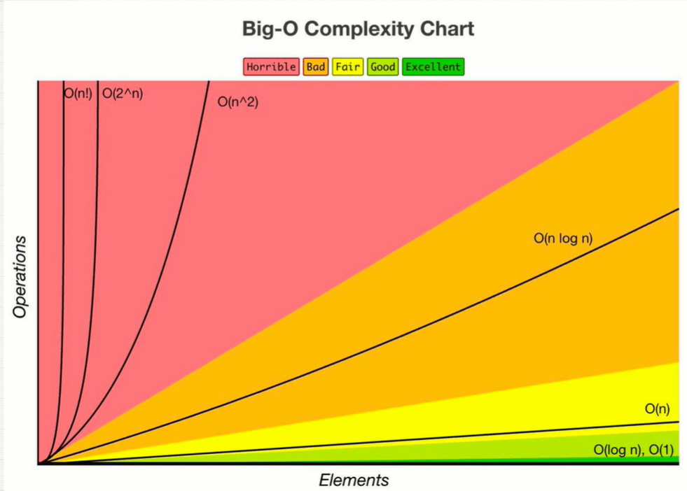

# DataStructuresAlgorithmsByCourse
Udemy Master the Coding Interview: Data Structures + Algorithms

##### 1. Big O 

**Official term:** Asymptotic Analysis:
It can tell us how well a problem is solved.
##### What is good or clean code?
1. **Readable**: can others understand.
1. **Scalable**: Big O notation is what allows us to measure this idea of scalable code that can scale.

* A runtime  is simply how long  something takes to run.

* That's what scalability means as things grow larger
 and larger
##### Big O notations
1. **O(n)** Linear time O(10),time O(1000) 
1. **O(1)** Constant time
##### 4 Rule Book
1. Worst Case
1. Remove Constants
1. Different terms for inputs -->
O(Arrayinput + ArrayInput2)
1. Drop Non Dominants

